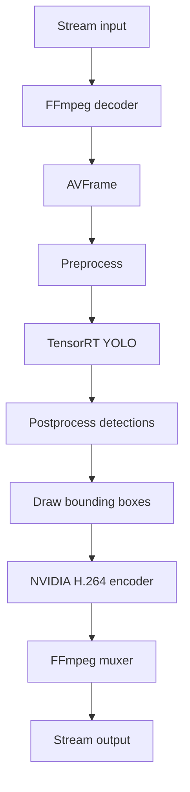

<div align="center">

# argus

**TensorRT YOLO Live Object Detection for Video Streams**

[](LICENSE)
[](https://en.cppreference.com/w/cpp/20)
[](https://cmake.org/)
[](https://developer.nvidia.com/tensorrt)

</div>

argus is a C++ live object detection pipeline for video streams. It decodes an
input with FFmpeg/libav, preprocesses frames for YOLO, runs inference with
TensorRT, draws bounding boxes on the decoded frame, encodes the result with
NVIDIA NVENC, and writes the processed video to a stream output.

The project is currently focused on learning and building the full video path
step by step.

## Demo

<p align="center">
  
</p>

The demo uses OpenCV's `vtest.avi` sample as an RTSP source relayed through
MediaMTX. The processed output shows YOLO detections drawn on the live stream
and re-published through RTSP.

## Features

- **Stream Input**: Opens video inputs through FFmpeg/libav, including RTSP, HLS, HTTP media, and local files
- **NVIDIA Decode Path**: Prefers CUVID decoders such as `h264_cuvid` when the input codec supports them
- **TensorRT Inference**: Builds and runs a TensorRT engine from a YOLO ONNX model
- **Frame Preprocessing**: Converts decoded frames into the RGB tensor layout expected by the model
- **Postprocessing**: Converts model output into detection boxes in source-frame coordinates
- **Bounding Box Overlay**: Draws detections directly onto the local decoded video frame
- **NVIDIA Encoding**: Encodes processed frames through `h264_nvenc`
- **Stream Output**: Writes encoded packets to RTSP, HLS, MP4, MPEG-TS, or Matroska outputs through FFmpeg/libav

## Pipeline

<div align="center">



</div>

## Requirements

- CMake 3.23 or later
- A C++20 capable compiler
- NVIDIA GPU with CUDA support
- CUDA Toolkit
- TensorRT
- FFmpeg development libraries:
  - `libavformat`
  - `libavcodec`
  - `libswscale`
  - `libavutil`
- An RTSP server for RTSP output, such as MediaMTX

The current encoder path expects FFmpeg to provide:

```text
h264_nvenc
```

The decoder path attempts to use NVIDIA CUVID decoders when available, for
example:

```text
h264_cuvid
hevc_cuvid
av1_cuvid
```

## Build

```bash
cmake -B build
cmake --build build
```

After exporting the YOLO ONNX model, build a TensorRT engine file:

```bash
./build/argus --build \
  --model input/models/yolov8n_dynamic_simplify.onnx \
  --engine output/yolov8n_dynamic_simplify.engine
```

Run the pipeline from an existing engine file:

```bash
./build/argus \
  --engine output/yolov8n_dynamic_simplify.engine \
  --input rtsp://source \
  --rtsp-transport tcp \
  --output rtsp://localhost:8554/argus
```

Use `--rtsp-transport udp` for sources that reject TCP interleaved RTSP.

## Output

The output type is selected from the `--output` URL:

```text
rtsp://localhost:8554/argus  RTSP
output/argus.m3u8            HLS
output/argus.mp4             MP4
output/argus.ts              MPEG-TS
output/argus.mkv             Matroska
output/argus.webm            WebM
```

For RTSP output, argus publishes to:

```text
rtsp://localhost:8554/argus
```

An RTSP server must already be running on `localhost:8554`. FFmpeg's RTSP
muxer publishes packets to that server. It does not replace a full RTSP server
process by itself.

With MediaMTX running locally, viewers can open:

```text
rtsp://localhost:8554/argus
```

For HLS output, argus writes a playlist and segment files:

```bash
./build/argus \
  --engine output/yolov8n_dynamic_simplify.engine \
  --input rtsp://source \
  --output output/argus.m3u8
```

The generated playlist can be checked with:

```bash
ffprobe output/argus.m3u8
```

## Source Layout

```text
src/
  decoder.*      input stream and packet-to-frame decoding
  preprocess.*   Frame conversion for YOLO input
  engine.*       TensorRT engine build and inference
  postprocess.*  Detection parsing and bounding box drawing
  encoder.*      AVFrame-to-H.264 packet encoding
  server.*       output muxing and packet writing
  main.cxx       Pipeline wiring

utils/
  streams.*      stream and FFmpeg helpers
  logger.*       timestamped logging

libs/
  cxxopts.hpp    command line option parsing
```

## Model Export

The current postprocess path expects a YOLO ONNX model with NMS included and an
output tensor shaped like:

```text
[batch, 300, 6]
```

For Ultralytics YOLOv8, export with:

```bash
yolo export model=yolov8n.pt format=onnx imgsz=640 opset=17 dynamic=True nms=True simplify=True
```

The `simplify=True` export has been tested with TensorRT. The non-simplified
NMS graph can build but fail at inference in TensorRT shape calculation.

## Development Notes

The frame overlay code writes directly into decoded YUV buffers. It currently
supports `nv12`, `yuv420p`, and `yuvj420p`. The NVIDIA CUVID H.264 path commonly
outputs `nv12`. If a stream decodes to another pixel format, the frame must be
converted before drawing and encoding, or the drawing path must be updated for
that format.

The encoder and output muxer are separated:

```text
encoder = raw AVFrame to compressed AVPacket
server  = compressed AVPacket to stream output
```

This separation keeps the video compression step independent from the output
transport step.

## Contributing

Contributions are welcome.

### Areas to Improve

1. Improve runtime performance.
2. Add AMD GPU support through ROCm.
3. Add multi-input stream support.
4. Expand stream input and output coverage, including webcams and additional network protocols.
5. Add structured logging for FFmpeg and TensorRT errors.
6. Add small integration tests for decoder, encoder, and muxer setup.

### Style

- Keep code C++20.
- Prefer clear ownership of FFmpeg objects in small structs.
- Keep decode, inference, encode, and output responsibilities separated.
- Check FFmpeg return values and print readable errors with `av_strerror`.
- Avoid adding unrelated refactors when changing one part of the pipeline.

## License

GNU Affero General Public License v3.0. See [LICENSE](LICENSE) for the full
text.
